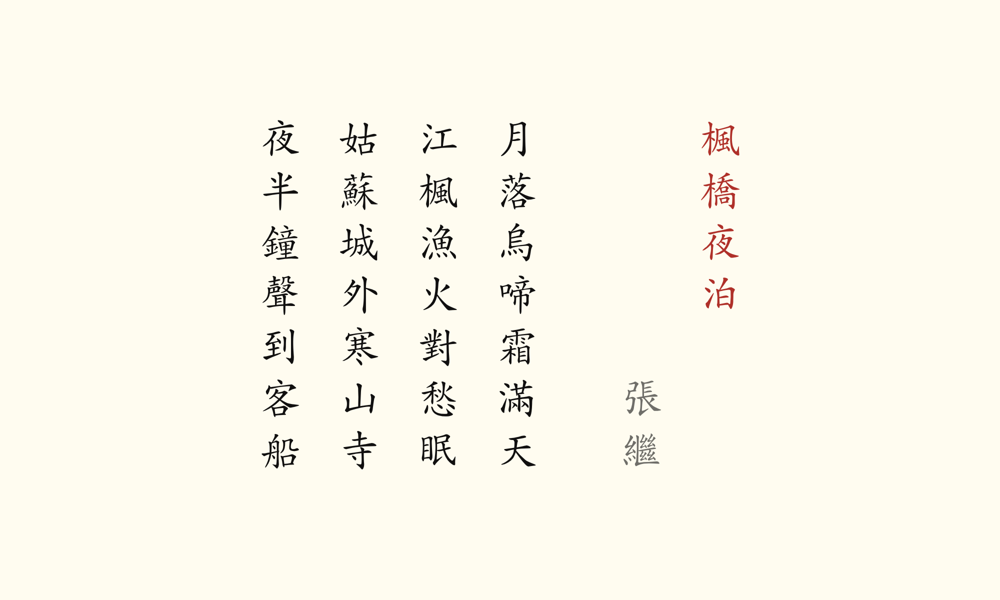
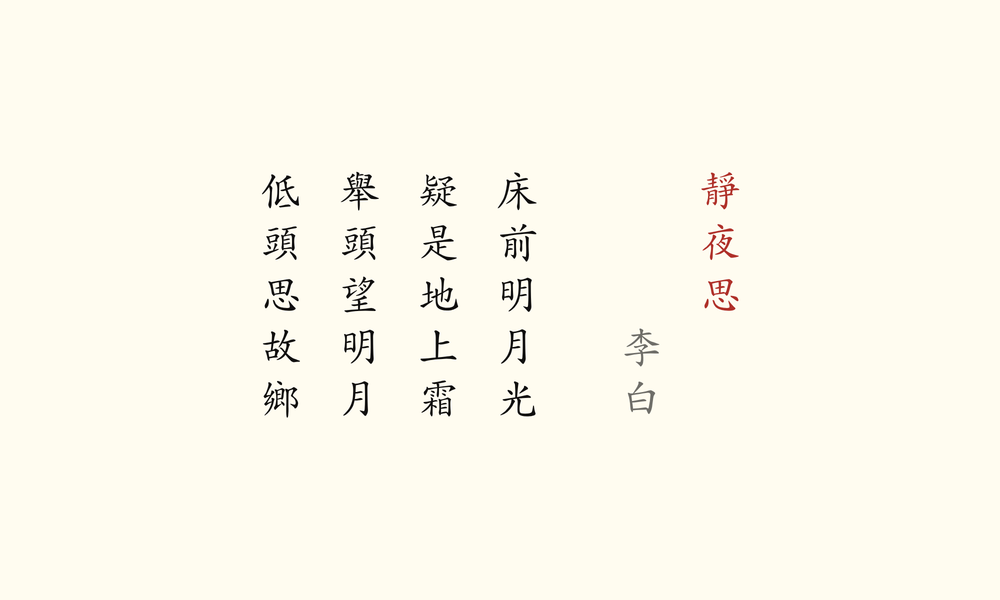
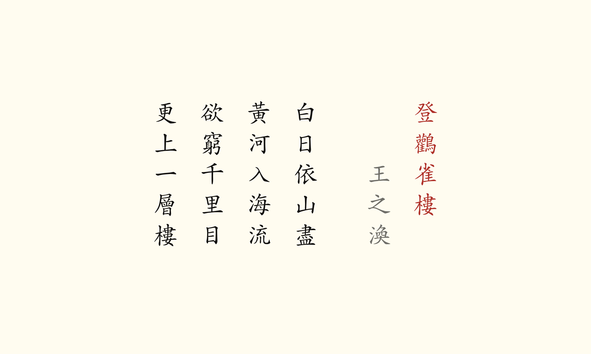
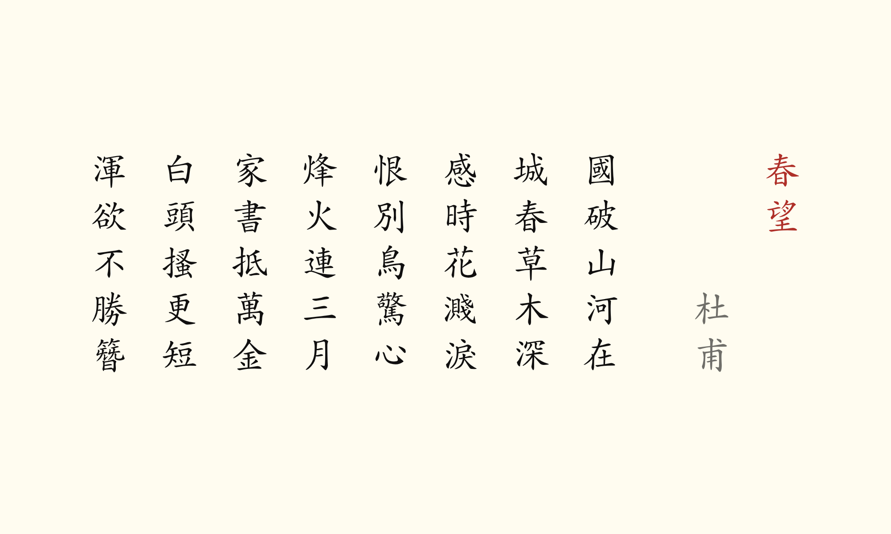

# Tang Poem Screensaver for Omarchy

A screensaver for [Omarchy](https://omarchy.org) that shows Chinese poems from the Tang dynasty (618–907) in black ink with red titles on a light, paper-colored background.



*A Night-mooring near Maple Bridge (楓橋夜泊) by Zhang Ji*

Each of the 35 poems fades in, stays on the screen for five minutes, and then fades out before the next one appears. The poems are written in vertical columns, read from top to bottom and right to left, with the title and the poet's name first. The poems are set in a brush-style kaishu (楷書) font, using traditional characters.

The screensaver closes as soon as you press a key or switch to another window.

| | |
|---|---|
|  |  |
| Quiet Night Thought (靜夜思) by Li Bai, one of the best-known Tang poems. Chinese children learn it in their first year of primary school. | Climbing Stork Tower (登鸛雀樓) by Wang Zhihuan |
|  |  |
| Gazing in Spring (春望) by Du Fu | A Night-mooring near Maple Bridge (楓橋夜泊) by Zhang Ji |

## The poems

- **Bai Juyi** (白居易, 772–846): A Question for Liu Nineteen (問劉十九); Grass on the Ancient Plain: A Farewell (賦得古原草送別)
- **Du Fu** (杜甫, 712–770): Quatrain (絕句); Gazing in Spring (春望); Enjoying Rain on a Spring Night (春夜喜雨); Climbing High (登高)
- **Du Mu** (杜牧, 803–852): Qingming Festival (清明); Mountain Walk (山行); Mooring on the Qinhuai River (泊秦淮)
- **He Zhizhang** (賀知章, c. 659–744): On Returning Home (回鄉偶書)
- **Jia Dao** (賈島, 779–843): Seeking the Master but Not Meeting (尋隱者不遇)
- **Li Bai** (李白, 701–762): Quiet Night Thought (靜夜思); Sitting Alone on Jingting Mountain (獨坐敬亭山); Leaving Baidi City at Dawn (早發白帝城); Seeing Meng Haoran Off to Guangling at Yellow Crane Tower (黃鶴樓送孟浩然之廣陵); Viewing the Waterfall at Mount Lu (望廬山瀑布)
- **Li Shangyin** (李商隱, c. 813–c. 858): On the Leyou Plateau (登樂遊原); Night Rain, Sent North (夜雨寄北); The Brocade Zither (錦瑟)
- **Li Shen** (李紳, 772–846): Pity the Farmers (憫農)
- **Liu Zongyuan** (柳宗元, 773–819): River Snow (江雪)
- **Meng Haoran** (孟浩然, c. 689–740): Spring Morning (春曉); Mooring on the Jiande River (宿建德江)
- **Meng Jiao** (孟郊, 751–814): The Song of a Wandering Son (遊子吟)
- **Wang Changling** (王昌齡, 698–756): Beyond the Frontier (出塞); Farewell to Xin Jian at Hibiscus Tower (芙蓉樓送辛漸)
- **Wang Han** (王翰, 687–726): A Song of Liangzhou (涼州詞)
- **Wang Wei** (王維, 699–759): Longing (相思); Deer Fence (鹿柴); Lodge in the Bamboo (竹裡館); Birdsong Brook (鳥鳴澗); Thinking of My Brothers on the Double Ninth Festival (九月九日憶山東兄弟); Seeing Yuan the Second Off to Anxi (送元二使安西)
- **Wang Zhihuan** (王之渙, 688–742): Climbing Stork Tower (登鸛雀樓)
- **Zhang Ji** (張繼, c. 715–c. 779): A Night-mooring near Maple Bridge (楓橋夜泊)

## Preview in a browser

To see what it looks like before installing, double-click `tang-poems.html`. Click once for full screen, and press Esc to leave.

## Install on Omarchy

Open a terminal and run:

```bash
git clone https://github.com/paulofrank/tang-poem-screensaver.git
cd tang-poem-screensaver
bash install.sh
```

The installer asks for your password once, to install the font. To update to a newer version later, just run it again.

To see the screensaver right away, run:

```bash
bash -lc 'omarchy-launch-screensaver force'
```

After that, it starts on its own whenever Omarchy's screensaver normally would.

## Customizing

The installed files are in `~/.config/omarchy/screensaver/`.

To add or remove poems, edit `tang-poems.txt`. Each poem takes up several lines: the title, then the poet, then one line per verse. Between two poems, put a line with nothing on it but a percent sign. For example:

```
靜夜思
李白
床前明月光
疑是地上霜
舉頭望明月
低頭思故鄉
%
春曉
孟浩然
春眠不覺曉
處處聞啼鳥
夜來風雨聲
花落知多少
```

To change how long each poem stays on the screen, change `HOLD_SECONDS = 300` (in seconds) at the top of `tang-screensaver`. To change the font size, change both `size=36` values in `foot.ini`. This works whichever terminal Omarchy uses, not just foot.

## Uninstall

```bash
bash uninstall.sh
```

This brings back Omarchy's own screensaver. If you've already deleted the downloaded folder, run this instead:

```bash
bash ~/.config/omarchy/screensaver/tang-screensaver-uninstall
```

To remove the font as well, run `omarchy pkg drop ttf-arphic-ukai`.

## Limitations

- I've tested the screensaver on two computers with Omarchy 4 (Quattro), both using foot, the default Omarchy 4 terminal. I haven't tested it with the other terminals Omarchy supports, such as Alacritty, Ghostty or Kitty.
- The font size is set for a large monitor. On a smaller screen, you may want to make it smaller (see Customizing). If a poem is too tall for the screen, it continues in an extra column.

## Credits and license

- © 2026 Paul Frank, Salgesch, Switzerland
- Poems: Tang dynasty (618–907), public domain
- Colors: [Flexoki](https://stephango.com/flexoki) by Steph Ango, as in Omarchy's Flexoki Light theme
- Font: [AR PL UKai](https://www.freedesktop.org/wiki/Software/CJKUnifonts/) by Arphic Technology (Arphic Public License), installed from the Arch Linux repositories
- Made for [Omarchy](https://omarchy.org), not affiliated with it
- Code: [MIT license](LICENSE)
